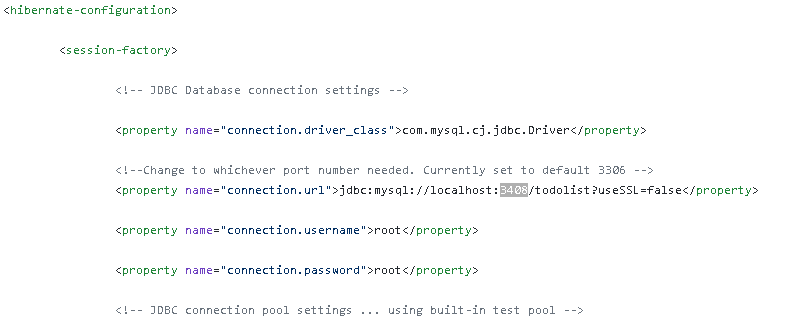
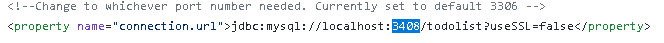
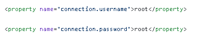

# JEE-ToDoList
To-do Java Enterprise project. Connects to a MySQL db using Hibernate ORM. Maven handles the dependency injections.

###Prerequisites
*Java must be installed on machine
*Tomcat is used as a server to run the backend
*MySQL database must be installed

###Setup
#####*MySQL database*
Open MySQL and import file Dump20200305.sql. Schema and test data should now be uploaded 

#####*Hibernate*
Because Hibernate is used to connect to the database it will need to be configured with the proper port number
and credentials to work for each individual user inside the **hibernate.cfg.xml** file. Photos below to help with this process

**Located inside the /src/main/resources folder**
Parts that may need to be changed inside the <session-factory> of <hibernate-configuration>

    
**Port Number**
Change port number to the port number used by MySQL connection. Generally 3306 unless changed.

**Login Credentials**
Change user and password used to connect to Database

Hibernate should now work correctly

